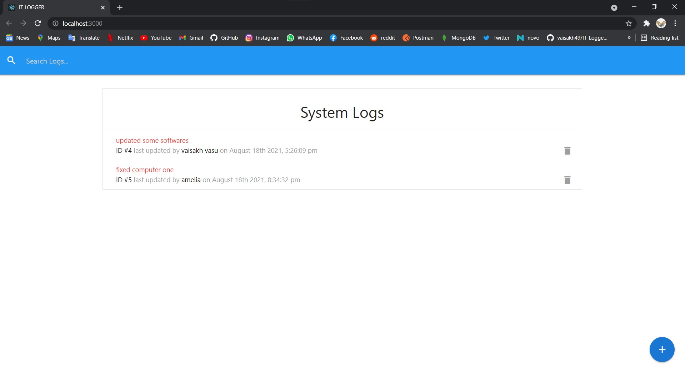
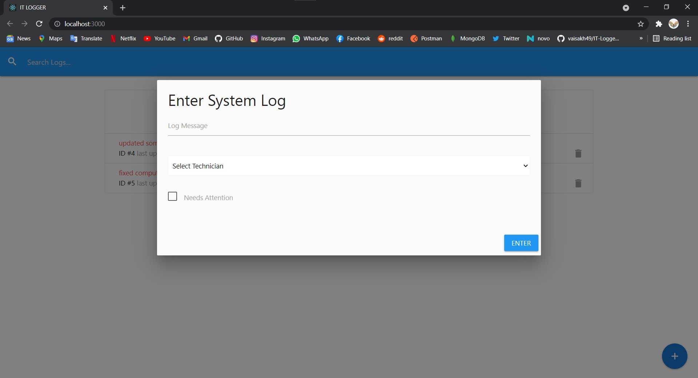
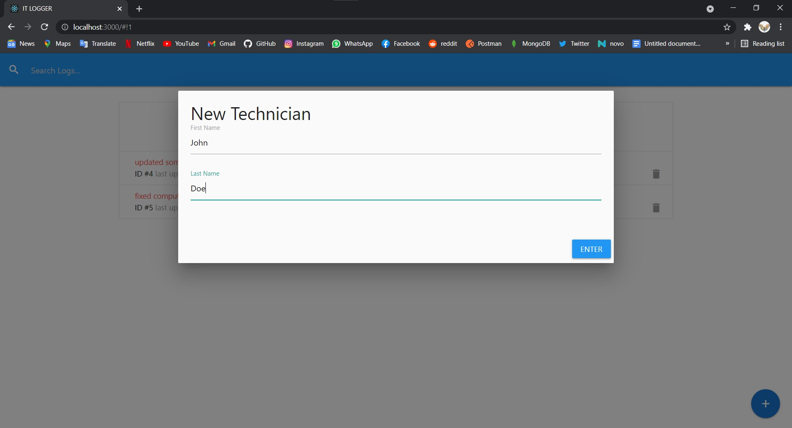
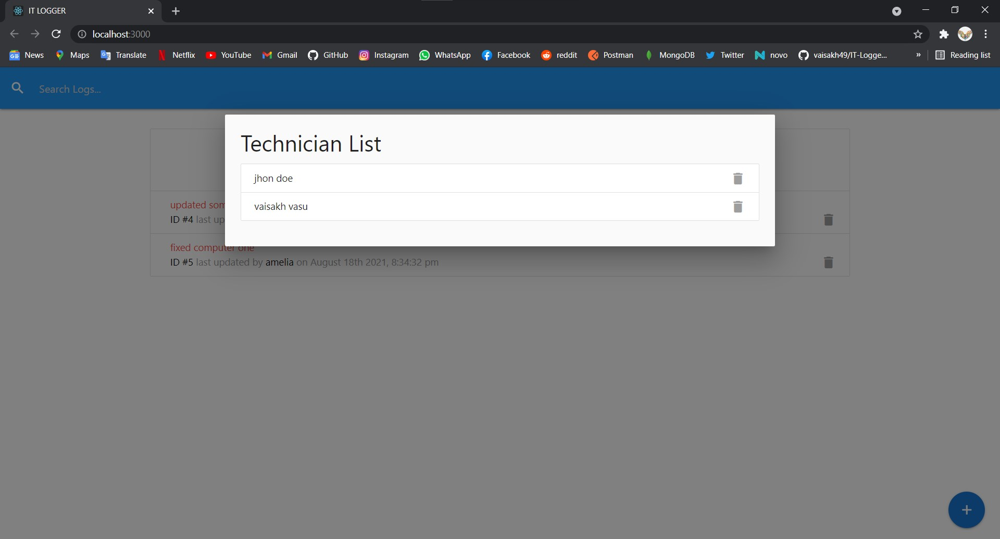

# IT-Logger
This application allows employees to post problems within the company and updating the post by solving that problem. This application use Redux as a state manager. json server use as  server. It's a CRUD application.
<h2>Screenshots</H2>

<h3>Home</h3>
 
  <h3>Add new log</h3>
 
  <h3>Add Technician</h3>
 
 <h3>Technitian list</h3>
 
